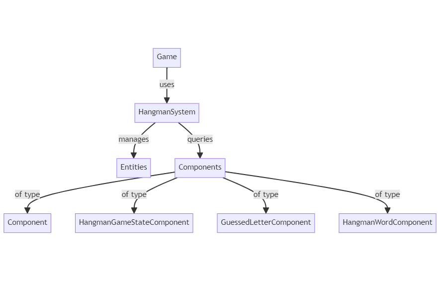
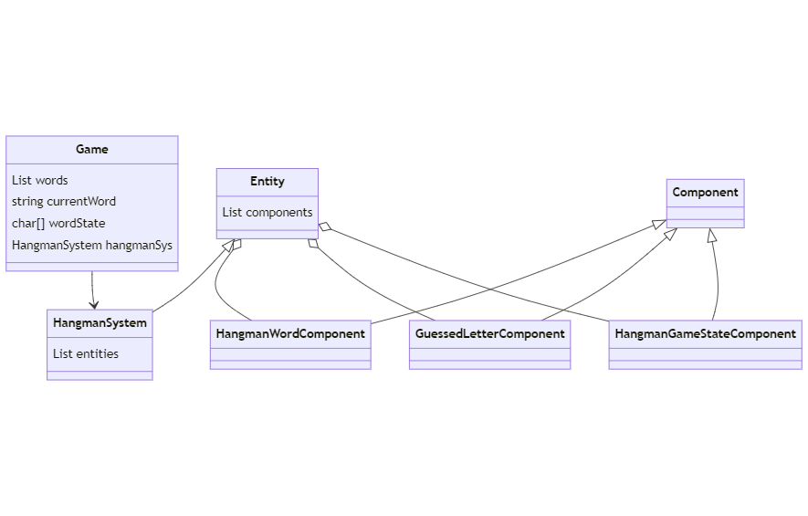
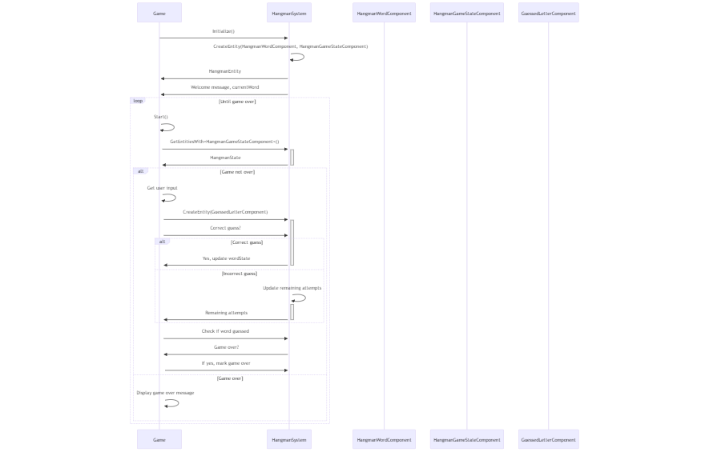

# Developer Documentation for Hangman Game
___

## Table of Contents
1. **[Introduction](#1-introduction)**
2. **[Technical Specifications and Design](#2-technical-specifications-and-design)**
3. **[Architectural Overview](#3-architectural-overview)**
    - 3.1. [Architectural Diagrams](#31-architectural-diagrams)
    - 3.2. [Main Components Overview](#32-main-components-overview)
    - 3.3. [Modules Folder Structure](#33-modules-folder-structure)
    - 3.4. [Utilities Folder Contents](#34-utilities-folder-contents)
4. **[Development Guidelines and Standards](#4-development-guidelines-and-standards)**
5. **[Testing Framework and Coverage](#5-testing-framework-and-coverage)**
    - 5.1. [Testing Strategy Outline](#51-testing-strategy-outline)
    - 5.2. [Code Coverage Analysis](#52-code-coverage-analysis)
6. **[Versioning Information](#6-versioning-information)**
7. **[Performance Metrics and Optimization](#7-performance-metrics-and-optimization)**
8. **[Accessibility Considerations](#8-accessibility-considerations)**
9. **[Troubleshooting and FAQs](#9-troubleshooting-and-faqs)**
10. **[Best Practice Recommendations](#10-best-practice-recommendations)**
11. **[References and Further Reading](#11-references-and-further-reading)**
12. **[Feedback and Updates](#12-feedback-and-updates)**

---

## 1. Introduction
This documentation serves as a detailed guide to the development of Hangman Game, utilizing C# and .NET Core. It is intended as a comprehensive resource for developers to understand and contribute effectively to the project.

---

#### 2. Technical Specifications and Design
- .NET Core:
  - Entities: Include components like `HangmanWordComponent`, `GuessedLetterComponent`, `HangmanGameStateComponent`.
  - Systems: Contains `HangmanSystem` for handling different functionalities.

- Rendering and Event Management: Utilizes .NET Core Console for graphical rendering and interaction handling.

---

#### 3. Architectural Overview
- **3.1. Architectural Diagrams**

  **System Architecture based on ESC structure**
  

  **Class Diagram based on ESC structure**
  

  **Sequence Diagram based on ESC structure**
  

- **3.2. Main Components Overview**
  - `Entity.cs`: Manages `Entity` class.
    - Purpose: Holds a list of components.
  - `Component.cs`: Manages `Component` class.
    - Function: Acts as a base class for other components.
  - `HangmanSystem.cs`: Manages `HangmanSystem` class.
    - Function: Handles the creation of entities and retrieval of entities with specific components.

---

#### 4. Development Guidelines and Standards
- Architecture Adherence: Follow the specified architectural principles for integration and modifications.
- Modularity: Ensure code is modular for easy updates and feature additions.
- Code Standard: Follow C# Coding Conventions to maintain code quality and readability.

---

#### 5. Testing Framework and Coverage
- **5.1. Testing Strategy Outline**
  - **Unit Testing**: Using NUnit, located in the `tests/` directory.

---
#### 6. Versioning Information
- **Project Version**: 1.0.0
- **Technology Versions**: .NET Core 3.1

---

#### 7. Performance Metrics and Optimization
**Key Metrics**:
- Game performance (response time)
- Memory usage

**Optimization Tips**:
- Optimize loops and data structures for better performance.
- Use efficient algorithms for game logic.

---

#### 8. Accessibility Considerations
- Console-based user interface for easy navigation.
- Clear and concise prompts for user input.

---

#### 9. Troubleshooting and FAQs
- **Q: The game doesn't start?**
  - A: Make sure .NET Core is installed and the project is built successfully.
- **Q: The game doesn't accept my input?**
  - A: Ensure you're entering a single letter as input.

---

#### 10. Best Practice Recommendations
- Keep methods small and focused on a single task.
- Use meaningful names for variables, methods, and classes.

---

#### 11. References and Further Reading
1. Microsoft, .NET Core Documentation.
2. Microsoft, C# Programming Guide.

---

#### 12. Feedback and Updates
Please contribute feedback to improve the project. [Check here](https://github.com/0Sebbe/hangman_ecs) for ongoing updates and project improvements.

---